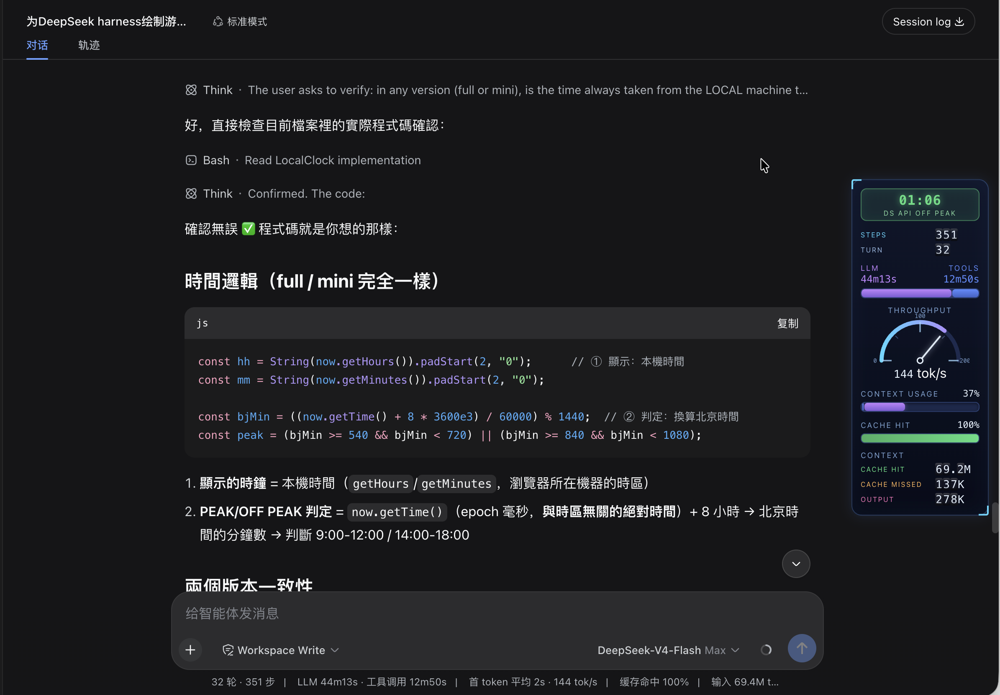
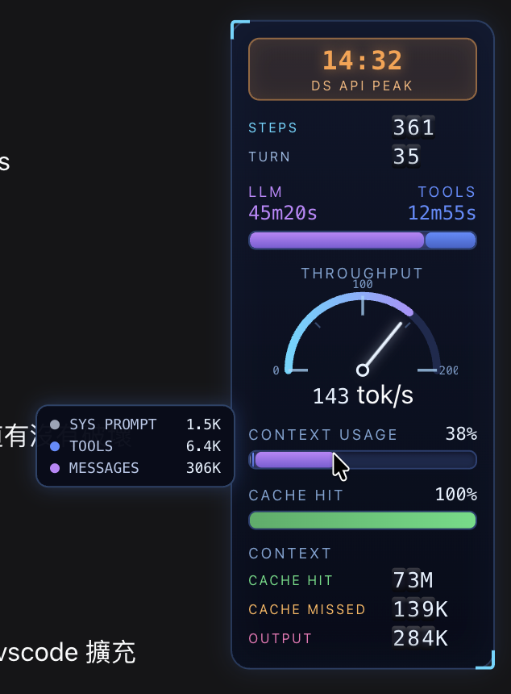
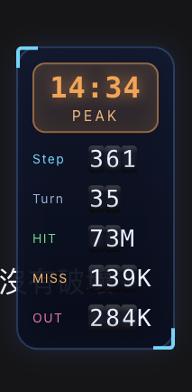

<div align="center">

**English** · [**简体中文**](README.zh-CN.md)

</div>

# dsh-stats-hud

A sci-fi HUD for [DeepSeek Harness](https://github.com/deepseek-ai/deepseek-harness): the session's stats become game-style level bars in a **vertical column fixed to the far right edge** of the web UI — without touching the original stats line.



## Instruments (all-English, LLM terminology)

| Instrument | Data | Full scale | Past full scale |
| --- | --- | --- | --- |
| `CLOCK` badge | Local time (24h) + `DS API PEAK` / `DS API OFF PEAK` rate | Peak = Beijing 09:00-12:00 / 14:00-18:00 (auto-converted from local time) | PEAK orange tint, OFF-PEAK green tint |
| `STEPS / TURN` rolling rows | Steps / turns as odometer drums (like the CONTEXT rows) | — | Drums spin up on mount, roll on change |
| `LLM / TOOLS` dual bar | Two columns (labels over values), bar segments = raw LLM:TOOLS time ratio | No cap — 2:1 time means 2:1 bar | — |
| `THROUGHPUT` gauge | tokens/s (throughput), centered title, combined centered readout (`146 tok/s`) | Redline auto-scales 200→300→400… (arc ticks follow) | — |
| `CONTEXT USAGE` bar | Context-window usage % with 3 segments: Sys Prompt (gray) / Tools (blue) / Messages (purple) by token ratio | 0-100% | ≥80% whole bar turns solid red; hover shows the three token counts |
| `CACHE HIT` bar | Cache-hit % | 0-100% | <50% red, <80% yellow, ≥80% green |
| `CONTEXT` rolling counter | Three odometer rows: CACHE HIT (green) / CACHE MISSED (orange) / OUTPUT (pink) | Drums spin up from 0 on mount; digits roll up on increase (carry 9→0), down on decrease | — |

While the agent is running the whole panel breathes and bars pulse.

Hovering the `CONTEXT USAGE` bar pops up a tooltip with the token breakdown:



## Responsive layout

The HUD adapts to the free space right of the chat column (measured live with a ResizeObserver, so sidebar drags, the details drawer and window resizes all count):

| Tier | Condition (free space) | Shows |
| --- | --- | --- |
| `full` | ≥ 200px | Everything |
| `mini` | ≥ 90px | Clock (short PEAK/OFF PEAK badge) + compact rolling rows (Step/Turn/HIT/MISS/OUT) |
| `hidden` | < 90px | Nothing (element stays mounted, `display:none`) |

The `mini` tier in a narrow window:



## Requirements

- DeepSeek Harness `dsh` (tested on 0.1.0-rc.6, macOS)
- pnpm (for plugin management)

## Install

```sh
# from a local checkout
dsh plugin --profile web add /path/to/dsh-stats-hud

# or straight from GitHub
dsh plugin --profile web add https://github.com/lauytgary/dsh_hud
```

Then **restart `dsh web`** (loader entries are scanned at boot) and refresh the page. The package is installed as a `link:` dependency — after editing `lib/client.js` locally, only a restart is needed, no reinstall.

## Uninstall

```sh
dsh plugin --profile web remove dsh-stats-hud
```

## How it works

- Registers into the `conversation.composer.dock` slot (id `dsh-stats-hud`, order 1) — **only to receive the session-scoped hooks** (`useSession`/`useProjection`); the panel itself is `position: fixed`, takes no layout space, and the stock stats line stays untouched.
- Data comes from the same projections the stock UI uses: `useProjection("sessionStats")`, `useProjection("tokenUsage")`, `useProjection("contextPressure")` and `useProjection("contextBreakdown")` — zero host-side changes.
- `exports.inject = ["slots"]` is mandatory: DSH's ctx is a strict proxy, and accessing an undeclared service throws (`cannot get property "locale" without inject`).
- The panel is `pointer-events: none` (click-through); only the CONTEXT USAGE bar re-enables pointer events so its hover tooltip works.

## Files

```
dsh-stats-hud/
├── package.json          # dsh.bundle (patch layer) + dsh.client (browser entry)
├── cordis.patch.yml      # inserts the plugin into loader entries
└── lib/
    ├── index.js          # host-side no-op (pure browser plugin)
    └── client.js         # browser bundle: HUD components + slot registration
```

`lib/client.js` is a hand-written loader bundle (`window.__ModuleLoader__.load`) — no build step needed.

## Tuning

All constants live in `lib/client.js`:

- Labels: the `L` object (all-English LLM terminology)
- Peak hours: `LocalClock`'s `bjMin >= 540 && bjMin < 720` (Beijing 9-12h) and `>= 840 && < 1080` (14-18h), with `bjMin = ((now.getTime() + 8*3600e3) / 60000) % 1440`
- `MissionRolling`: rolling drums for steps/turns (no full scale)
- `ChannelBar`: segment ratio = `llmMs / (llmMs + toolMs)` (no cap)
- `SpeedGauge`'s `redline = 200` (initial; `while (tps > redline) redline += 100` auto-scales)
- `ContextUsageBar`: segment colors and the ≥80% solid-red threshold; the hover tooltip reads `systemTokens` / `toolsTokens` / `messageTokens` from the `contextBreakdown` projection
- Rolling counter: `DRUM` (3× 0-9), `DRUM_H = 15` (px per digit), `RollingValue`'s carry/borrow formula and mount spin-up
- CSS: `position:fixed; right:12px`; tiers in `tierOf(space)` (`≥200` full / `≥90` mini / else hidden) and the `.gsh-root.gsh-*` rules

## Publishing to npm (optional)

```sh
# remove "private": true from package.json, then
npm publish
# users install with:
dsh plugin --profile web add dsh-stats-hud
```

## License

MIT
